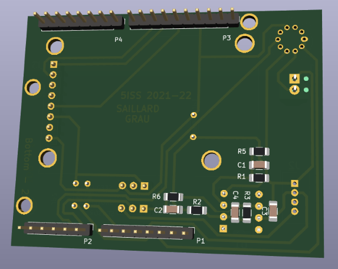

#2021_2022_Saillard_Grau
#Gas sensor connected Project 

##SUMMARY
* 1 [Project description](#description)
* 2 [Gas sensor based on nanoparticles](#paragraph2)
* 3 [Analog circuit + PCB Elaboration](#paragraph3)
* 4 [Microcontroler and Open Source Hardware](#paragraph4)

-------
## 1 - Project description 

This projet is realised in the UF "SmartDevice" of the MSIoT master.
The aim is to design and build a smart device based on the combination of a gas sensor and an electronic card to communicate data over a low speed network.
This project addresses many concepts: the physics of nanoparticle sensors, the writing of a datasheet, analog electronics, Arduino Uno, the production of a PCB, the design of a test bench and communication via wireless network.

*Deliverables* :

1. Gas sensor Datasheet : Composed of a description, specifications, specifics characteristics (electrical, thermal), package dimensions and typical applications
2.Analog circuit + PCB Elaboration : The board accepts two gas sensors inputs with a transimpedence conditionner. It can be plug on an Arduino Uno Board below and a LoRa module board can be plug on the top.
3. Microcontroler and Open Source Hardware: ARDUINO code has in input one of the 2 annalog gas sensor voltage and a digit input for the choice of sensor. It transmits gas concentration variation to The Thing Networks via a LoRa RN2483 component.
--------
## 2 - Gas sensor based on nanoparticles
The gas sensor was made by ourself in the AIME clean room with chemicals technics. Then the gas sensor was placed on a TO5-10 box. 
All essential electricals characteristics were measured.
The datasheet was built there : >AIME [datasheet]

---------

## 3 - Analog circuit + PCB Elaboration 

### Analog Circuit Simulation
The goal of this part was to simulate our sensor and its associated electronic diagram thanks to LTSpice. 
The sensor resistivity is up the Giga Ohms so to measure it we have to inject a voltage reference and by a bridge resistor and an amplifier to amplifier the signal to acquire it.
The LT1050 choice is done because of is a high performance and zero-drift amplifier. It is often use to measure low signal sensors.

### Conditioner Diagram

In order to obtain the cutoff frequencies of the different steps and observe the noise attenuations at 50kHz and at the Nyquist frequency.
To remember, the cutoff frequency is calculate by this formula: fc = 1 / (2 * 𝜋 * R * C)

The first passive bypass filter is composed of C1 and R1 components, the aim is to attenuate the 230VAC-50Hz frequency with fc = 15.9Hz.
The second one composed by C4 and R3 is an active bypass with a cutoff frequency fc = 1.6Hz
The third one composed by R6 and C2 is a passive bypass with fc = 1.6kHz to cutoff the noise make by the processing.
The  Analog to Digital Converter of the microcontrolerhas a sample frequency of 200Hz for 13bits so a frequnec by bit of 15kHz. If we take the middle of this the frequency, we have d Nyquist frenquency of 7.75kHz. It is why we choose the fc = 1.6Khz to be sure of the well done cutoff.

### Filters characteristics

### Electronic Diagram

### TODO Kicad

- [x] Create Kicad project
- [x] Design the circuit board
- [x] Assign the components footprints
- [x] Design of the pcb
- [x] Component placement
- [x] Routing

### Schematic

### Placement and Routing
we made it clear not to build a ground plane on the circuit. 
Indeed there could have been short-circuits with the tracks because of the INSA manufacturing method.
The jumpers JP1, JP2 and JP3 are only straps to keep one bottom side soldering.
We can choice which sensor to use (the SEED grove MCQ5 or the GSWO3AIME) by strapping J5 and J4 pins by a jumper.
The LoRa RNB2483/2993 module given by INSA and sell by Drazzy.com will be plug on the topside of the board on J3.

### 3D View

## 4 - Microcontroler and Open Source Hardware
This part was focused on exploiting the data from the gas sensor. The idea is to recover the data from the sensor using an arduino, process this data with the Arduino software, send it over the LoRa network and retrieve it on The Things Network.

You'll find the related files under >LoRa_gaz_sensor>LoRa_gaz_sensor.ino

## Contribution

### Students

* Victor GRAU
* François SAILLARD

### Tutors

* Jérémie GRISOLIA
* Arnauld BIGANZOLI
* Benjamin MESTREAIME