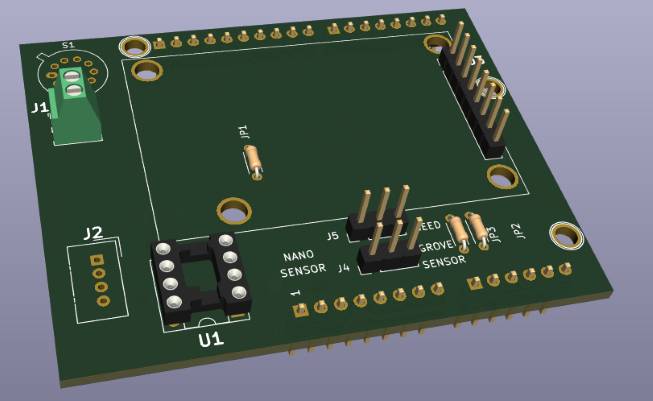

#2021_2022_Saillard_Grau
# Gas sensor connected Project 

##SUMMARY
* 1 [Project description](#description)
* 2 [Gas sensor based on nanoparticles](#paragraph2)
* 3 [Analog circuit + PCB Elaboration](#paragraph3)
* 4 [Microcontroler and Open Source Hardware](#paragraph4)

-------
## 1 - Project description 

This projet is realised in the UF "SmartDevice" of the MSIoT master.
The aim is to design and build a smart device based on the combination of a gas sensor and an electronic card to communicate data over a low speed network.
This project addresses many concepts: the physics of nanoparticle sensors, the writing of a datasheet, analog electronics, Arduino Uno, the production of a PCB, the design of a test bench and communication via wireless network.

*Deliverables* : 

1. Gas sensor Datasheet : Composed of a description, specifications, specifics characteristics (electrical, thermal), package dimensions and typical applications
2.Analog circuit + PCB Elaboration : The board accepts two gas sensors inputs with a transimpedence conditionner. It can be plug on an Arduino Uno Board below and a LoRa module board can be plug on the top.
3. Microcontroler and Open Source Hardware: ARDUINO code has in input one of the 2 annalog gas sensor voltage and a digit input for the choice of sensor. It transmits gas concentration variation to The Thing Networks via a LoRa RN2483 component.
--------
## 2 - Gas sensor based on nanoparticles
The gas sensor was made by ourself in the AIME clean room with chemicals technics. Then the gas sensor was placed on a TO5-10 box. 
All essential electricals characteristics were measured.
The datasheet was built there : >AIME [datasheet]

---------

## 3 - Analog circuit + PCB Elaboration 

### Analog Circuit Simulation
The goal of this part was to simulate our sensor and its associated electronic diagram thanks to LTSpice. In order to obtain the cutoff frequencies of the different steps and observe the noise attenuations at 50kHz and at the Nyquist frequency.

### Electronic Diagram

### Conditioner Diagram

### Filter characteristics

### TODO Kicad

- [x] Create Kicad project
- [x] Design the circuit board
- [x] Assign the components footprints
- [x] Design of the pcb
- [x] Component placement
- [x] Routing

### Schematic

### Placement and Routing

### 3D View

## 4 - Microcontroler and Open Source Hardware
This part was focused on exploiting the data from the gas sensor. The idea was to interconnect several technologies; recover the data from the sensor using an arduino, process this data with the Arduino software, send it over the LoRa network and retrieve it on The Things Network.

You'll find all the related files under >LoRa_gaz_sensor>LoRa_gaz_sensor.ino

## Contribution

### Students 

* Victor GRAU
* François SAILLARD

### Tutors

* Jérémie GRISOLIA
* Arnauld BIGANZOLI 
* Benjamin MESTRE